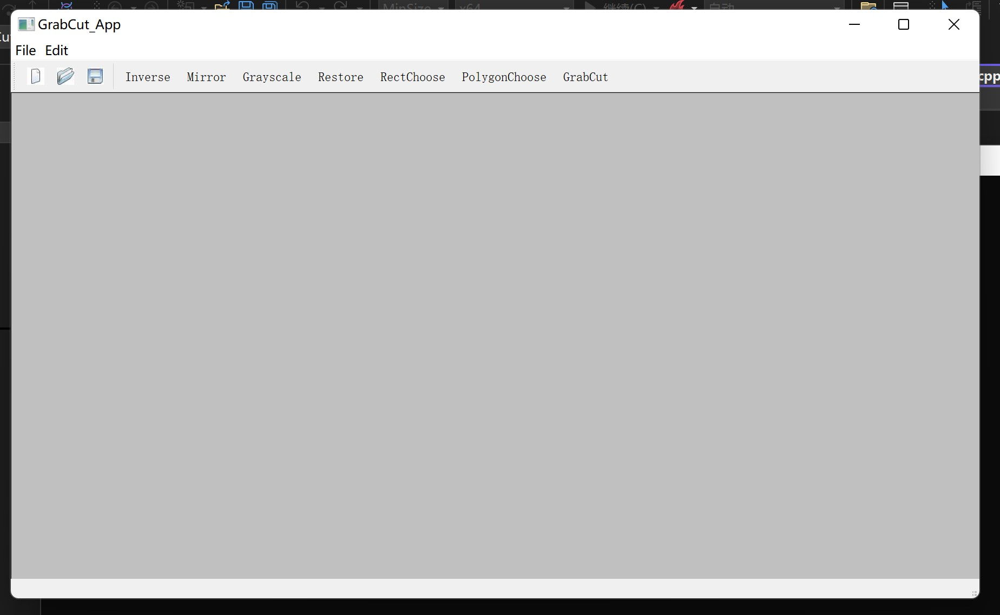

# GrabCut

pure C++ method implement GrabCut algorithm

## ENV

> Qt5
> 
> Eigen3
> 
> maxflow
> 
> Visual Studio C++

## how to install

```
mkdir build
cd build
cmake ..
```

## Core Code

in src/App/

GMM.h,GMM.cpp for Gaussian Mixture Modeling;

GrabCut.cpp and GrabCut.h for main algorithm

## how to use

mainwindow like this



use open to load an image, and then choose polygon Choose , select the region and Click GrabCut

resutl like this.jpg)

.jpg)
